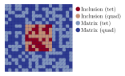

# Package design

At the top level, the user of `FerriteAssembly` needs to interact with two main types of objects, a *domain buffer* (or a `Dict` of multiple domain buffers) and a *worker*
(for example an assembler). 

## Worker 
The worker is the simplest object, and determines what is done for each item in the domain(s).

## Domain buffer
Two domain buffer types are implemented, a regular and a threaded version. To understand the structure, it sufficies to to understand the regular buffer. The threaded version just contains additional values to have per-task buffers etc. 
The key fields of the `DomainBuffer` type are (1) a `set` of items to iterate over (for example a vector of `Int` for a list of cells or a vector of `FacetIndex` for a list of facets) and an `itembuffer` (e.g., `CellBuffer` or `FacetBuffer`) containing the data required to do something for each entity. 

### ItemBuffer
The most important fields in an item buffer are the user-defined `material` and the `FEValues` (e.g. `CellValues` or `FacetValues`). 

### Requirements for being a domain
In addition to having the same `FEValues` and `material`, 
the items in a domain must also share the same `SubDofHandler`. 
However, multiple domains can share the same `SubDofHandler`.

### Setting up one domain
Each domain is described by a `DomainSpec`. Based on a `DomainSpec`, we call 
the function `setup_domainbuffer` to create a `DomainBuffer`. The motivation 
for this two-stage process, is to separate the information given and to simplify 
setting up multiple domains. Depending on the options given to `setup_domainbuffer`,
different buffers can be returned, such as `ThreadedDomainBuffer` or a domain buffer with a special `AutoDiffCellBuffer` to speed up automatic differentiation. 

### Multiple domains
Figure 1 shows an example of a mesh, containing both 
`Quadrilateral` and `Triangle` elements, as well as two different materials,
which we call "matrix" and "conclusion". In this case, we could have two `SubDofHandlers`, one for triangles and one for quadrilateral. If we would like to assemble the cell contribution for this grid, we need four different domains, 
shown by the different colors in the figure. 
This is because the the `CellBuffer` would contain different `material` types for each domain, and we would require different `CellValues` for the triangles and quadrilaterals. 

Figure 1: Domains

When setting up the domains, we collect all domains into a `Dict`, which is 
done by calling `setup_domainbuffers(::Dict{String,DomainSpec}; kwargs...)`,
where the keyword arguments are the same as for a single domainbuffer. 

### User-defined overloaded functions
The user interacts with `FerriteAssembly` on the top level, when setting up the domain buffer and the worker. But to make it work, the user must also overload 
several functions that happen at the innermost part of the iteration of items in the grid. Some key functions to be overloaded are 

* `element_routine!`: Calculate `Ke`, `re`, and `state`
* `element_residual!`: Calculate `re`, and `state`
* `create_cell_state`: For the given material and initial cell dof values, return the initial value of the cell state. Typically one value per integration point. 
* `allocate_cell_cache`: Define workspace for calculation on a single cell
* `allocate_facet_cache`: Same as above, but for a facet 

### State variables
State variables (both current and old) are stored as a `Dict{Int}` in the domain buffer (for cells, not for facets, this may be added in the future). 
The key corresponds to the cell id, and the state can be gotten with the 
`get_state` and `get_old_state` functions. 

### User-data
All item buffers contain a `user_data` field for passing any additional information to the item being worked. In most cases, this should not be necessary, but it provides an easy way to do something that is not normally supported. 
The object is passed around as reference; care must thus be taken to avoid race conditions if written to during threaded work.

